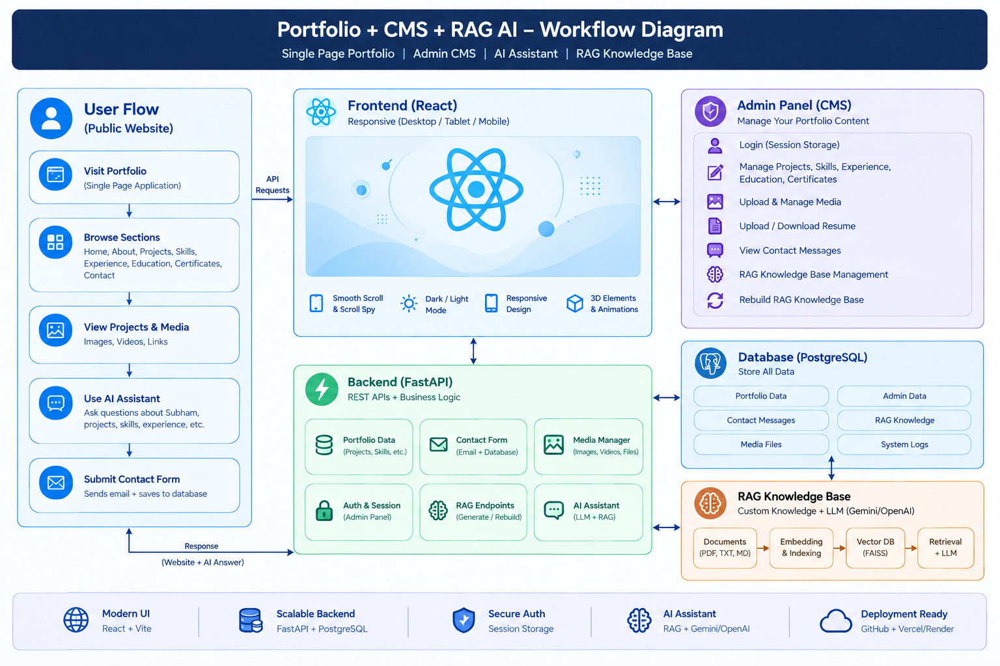

# Subham RAG Portfolio

An AI-powered personal portfolio built with **FastAPI, SQLite, ChromaDB, Embeddings, and Retrieval-Augmented Generation (RAG)**.

The project combines a modern portfolio website with an intelligent AI assistant that can answer questions about my profile, skills, projects, education, experience, and other portfolio-related information using a dedicated knowledge base.

## 🚀 Project Workflow

```text
User
  ↓
Portfolio Website
  ↓
AI Assistant
  ↓
Query Processing
  ↓
ChromaDB Vector Search
  ↓
Relevant Knowledge Retrieval
  ↓
LLM Response Generation
  ↓
Context-Aware Answer
```

The detailed workflow diagram is available here:



## ✨ Features

- 🤖 AI-powered portfolio assistant
- 🔎 Retrieval-Augmented Generation (RAG)
- 🧠 Semantic search using vector embeddings
- 🗃️ ChromaDB vector database
- ⚡ FastAPI backend
- 💾 SQLite database
- 📄 Knowledge-base driven responses
- 📬 Contact form with backend API
- 🌐 Modern responsive portfolio interface
- 💬 Context-aware answers about projects, skills, education, and experience
- 🔐 Secure environment-based API configuration

## 🧠 How the RAG Assistant Works

The assistant uses a **Retrieval-Augmented Generation** pipeline instead of relying only on the language model's general knowledge.

Portfolio information is stored in a knowledge base and converted into vector embeddings.

When a user asks a question:

1. The user's query is received by the backend.
2. The query is converted into an embedding.
3. ChromaDB performs semantic similarity search.
4. Relevant portfolio information is retrieved.
5. The retrieved context is provided to the language model.
6. The LLM generates a context-aware response based on the retrieved information.

This allows the assistant to answer questions using information specifically related to the portfolio.

## 🛠️ Tech Stack

### Frontend

- HTML
- CSS
- JavaScript
- Responsive UI

### Backend

- Python
- FastAPI
- Uvicorn

### AI / RAG

- Retrieval-Augmented Generation
- Large Language Models (LLMs)
- Text Embeddings
- Semantic Search
- Context-Aware Response Generation

### Vector Database

- ChromaDB

### Database

- SQLite
- SQLAlchemy

### Deployment

- Vercel
- FastAPI-compatible backend deployment

## 📂 Project Structure

```text
subham-rag-portfolio/
│
├── backend/
│   ├── main.py
│   ├── database.py
│   ├── models.py
│   ├── rag/
│   └── ...
│
├── frontend/
│   ├── index.html
│   ├── style.css
│   ├── script.js
│   └── ...
│
├── data/
│   └── knowledge-base/
│
├── chroma_db/
│
├── requirements.txt
├── README.md
└── .gitignore
```

> The project structure may evolve as new features are added.

## 🔧 Core Components

### FastAPI

FastAPI powers the backend API and handles communication between the portfolio frontend, database, and AI assistant.

### ChromaDB

ChromaDB stores vector embeddings and enables semantic similarity search across the portfolio knowledge base.

### Embeddings

Portfolio information is transformed into numerical vector representations, allowing semantically similar queries and documents to be matched.

### RAG Pipeline

The RAG pipeline retrieves relevant portfolio information before generating an answer, helping the assistant provide portfolio-specific responses.

### SQLite

SQLite provides lightweight local data storage for application-related information.

## 💬 Example Questions

Visitors can ask questions such as:

- Who is Subham?
- What are Subham's technical skills?
- What AI/ML projects has Subham built?
- Explain the FraudShield AI project.
- What technologies are used in the portfolio?
- What experience does Subham have?
- What is Subham's educational background?
- How can I contact Subham?

The assistant retrieves relevant information from the knowledge base before generating the response.

## ⚙️ Local Setup

### 1. Clone the Repository

```bash
git clone https://github.com/DasSubham-2005/subham-rag-portfolio.git
cd subham-rag-portfolio
```

### 2. Create a Virtual Environment

```bash
python -m venv venv
```

### 3. Activate the Virtual Environment

Windows PowerShell:

```powershell
.\venv\Scripts\Activate.ps1
```

### 4. Install Dependencies

```bash
pip install -r requirements.txt
```

### 5. Configure Environment Variables

Create a `.env` file and add the required API configuration.

Example:

```env
LLM_API_KEY=your_api_key
```

> Never commit API keys, passwords, or other sensitive credentials to GitHub.

### 6. Start the FastAPI Backend

```bash
uvicorn backend.main:app --reload
```

The backend will normally be available at:

```text
http://127.0.0.1:8000
```

## 📡 API Documentation

FastAPI provides interactive API documentation.

After starting the backend, open:

```text
http://127.0.0.1:8000/docs
```

The API documentation can be used to inspect and test the available endpoints.

## 🎯 Purpose of the Project

This project demonstrates how **Generative AI and Retrieval-Augmented Generation can be integrated into a real-world web application**.

Instead of building a standalone chatbot, the project applies RAG to a practical use case: an intelligent personal portfolio assistant.

The project demonstrates practical concepts including:

- API development
- Vector databases
- Embeddings
- Semantic retrieval
- RAG architecture
- LLM integration
- Database management
- Frontend-backend integration
- AI application deployment

## 📈 Future Improvements

- Improved conversational memory
- Better retrieval and ranking
- Advanced document ingestion
- Additional knowledge sources
- Streaming AI responses
- RAG evaluation and response quality measurement
- Authentication and user-specific features
- Advanced AI agent capabilities

## 👨‍💻 About

**Subham Das**

B.Tech Computer Science & Engineering student focused on building practical AI-powered applications.

### Areas of Focus

- Artificial Intelligence
- Machine Learning
- Deep Learning
- Natural Language Processing
- Large Language Models
- Generative AI
- Retrieval-Augmented Generation
- Agentic AI

## 📌 Project Status

**Status:** Active Development

The project is continuously being improved with new AI, RAG, and portfolio capabilities.

## ## 📄 License

Copyright © 2026 Subham Das. All rights reserved.

This project and its contents are protected by copyright. No permission is granted to copy, modify, distribute, publish, sublicense, sell, or reuse the source code or other original materials without prior written permission from the copyright holder.

For complete terms and permission requests, please refer to the [LICENSE](LICENSE) file.

## ⭐ Support

If you find this project useful or interesting, consider giving the repository a ⭐ on GitHub.

---

**Built with Python, FastAPI, RAG, ChromaDB, and Generative AI.**
